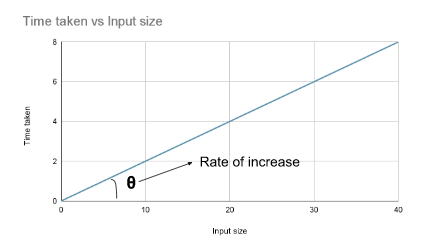
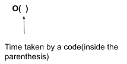
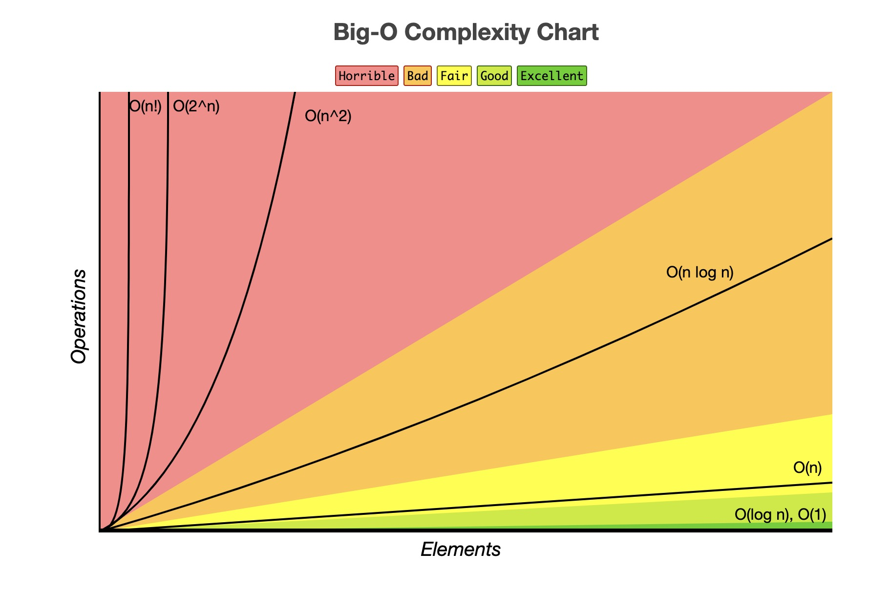

Big O notation là một khái niệm quan trọng trong khoa học máy tính nói chung và cấu trúc dữ liệu, thuật toán nói riêng.

"Big O notation" là một biểu thức toán học, biểu diễn "độ phức tạp" của một thuật toán. Nó mô tả mối liên hệ giữa input (đầu vào) và thời gian chạy, hoặc bộ nhớ mà chương trình sử dụng.

Tuy nhiên, khi đo độ hiệu quả (từ việc đánh giá độ phức tạp) của thuật toán, *ta thường quan tâm đến thời gian chạy nhiều hơn*, do máy tính ngày nay không bị giới hạn bởi bộ nhớ do sự phát triển của ngành.

Khái niệm độ phức tạp về thời gian và bộ nhớ: **Time Complexity** và **Space Complexity**.

## Time Complexity

**Định nghĩa**: Độ phức tạp về mặt thời gian là tỉ lệ thay đổi về mặt "thời gian" với "input size" thay đổi.

"Thời gian" ở đây không được hiểu theo nghĩa thông thường là "phút" hoặc "giây", vì những yếu tố đó có thể thay đổi dựa vào cấu hình máy tính mạnh hay yếu. Một con máy tính với CPU khỏe có thể thực hiện được nhiều phép tính trong một giây hơn, thời gian chạy (tính bằng phút, giây) cũng sẽ nhanh hơn so với một con máy tính có CPU yếu.

Nên hiểu "thời gian" như là số operation, hay số "steps" được thực hiện, so với input size.



Trong hình vẽ trên, ta thấy khi input tăng, thời gian chạy của hàm cũng tăng lên theo một tỉ lệ nhất định (rate of increase).

### Cách biểu diễn độ phức tạp về mặt thời gian

Ta dùng biểu thức **Big O** để biểu diễn độ phức tạp về mặt thời gian của một hàm.


Xem xét một đoạn code Go sau:

```go
for i := 0; i < 5; i++ {
  fmt.Println(i)
}
```

Độ phức tạp về mặt thời gian của đoạn code này là các step được thực thi. Viết dưới dạng Big O notation, nó sẽ là O( *số step* ).

Các step của đoạn code trên như sau:

* (1) Gán `i = 0`
* (2) Check điều kiện `i < 5`
* (3) In ra giá trị của i
* Tăng giá trị i lên 1
* Tiếp tục check điều kiện `i < 5`
* Tiếp tục in ra giá trị của i

Cứ thế lặp lại cho đến khi i = 5. Tổng số là 5 vòng lặp, ta có thể thấy step (1), (2), (3) luôn xảy ra ở mỗi vòng lặp. Tổng cộng sẽ là 3 * 5 = 15 steps. Vậy độ phức tạp của đoạn code này là O(15).

Với *N vòng lặp*, mỗi vòng lặp luôn có 3 steps, ta sẽ có độ phức tạp là O(3*N).
Tuy nhiên việc đếm bằng tay để xác định độ phức tạp là một quá trình khó khăn và không khả thi với một số step bất kì. Một vòng `for` có thể có rất nhiều steps, lên đến hàng trăm hàng triệu nên chúng ta phải tiếp cận theo một hướng tốt hơn.

Có một số luật chúng ta có thể dùng để xác định *Time Complexity* một cách hiệu quả và đơn giản hơn:

* Tính toán Time Complexity cho "worst-case scenario"
* Bỏ qua các hằng số trong biểu thức: O(2N) = O(N)
* Giữ lại số hạng có bậc cao nhất: O(n^2 + n) = O(n^2)

## Space Complexity

Big O notation có thể được dùng cho lượng bộ nhớ mà thuật toán / chương trình sử dụng.

**Định nghĩa**: Độ phức tạp về mặt không gian (hay bộ nhớ) đề cập đến lượng bộ nhớ mà một thuật toán sử dụng.

Xem xét một đoạn code Go sau:

```go
func merge(arr []int) []int{
  return append(arr, arr...)
}
```

Hàm `append()` tạo một slice mới, với số lượng phần tử gấp đôi input ban đầu, vậy Big O là O(2n), tối giản thành O(n)

## Một số Big O notation phổ biến



Có thể áp dụng cho cả thời gian và bộ nhớ của một thuật toán

* O(1): Constant time/memory
* O(log n): Logarithmic time/memory
* O(n): Linear time/memory
* O(n log n): Log-linear time/memory
* O(n^2): Quadratic time/memory
* O(2^n): Exponential time/memory
* O(n!): Factorial time/memory

## Kết

Thường trong những bài tập giải thuật, ta ưu tiên tối ưu về mặt thời gian trước, trừ khi đặc thù đề bài cụ thể chỉ ra giới hạn về mặt bộ nhớ.

Có rất nhiều cách, nhiều thuật toán khác nhau để tiếp cận cùng một vấn đề, nhưng làm sao giải quyết một cách hiệu quả nhất thì cần phân tích, đánh giá độ phức tạp dựa trên Big O notation.
