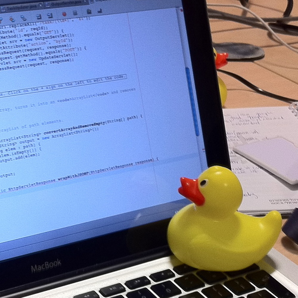

Mình mua domain duongquoctue.com cũng đã lâu, để dùng cho nhiều mục đích, tuy nhiên mục đích lớn nhất vẫn là viết blog. Không biết bao nhiêu lần mình đã lên kế hoạch, rồi lại trì hoãn, và lại lên kế hoạch, cái vòng luẩn quẩn.

Sang năm 2024, domain auto gia hạn, mình nhớ ra, và mình cũng muốn dùng chính bài viết này để nhắc nhở bản thân lí do mình bắt đầu.

Vậy tại sao mình, hay mỗi chúng ta, nên viết blog?

### Hiệu ứng Protégé

The Protégé Effect (hiệu ứng Protégé), là khi nếu bạn biết rằng bạn chịu trách nhiệm truyền đạt một thông tin cho ai đó, hay một nhóm người nào đó, bạn sẽ có xu hướng tìm hiểu thông tin đó một cách cặn kẽ hơn.

Có một trò đùa trong ngành của mình, về một phương pháp dùng để debug, đó là <a href="https://rubberduckdebugging.com/" target="_blank">Rubber Duck Debugging</a>, mà mình nghĩ về bản chất nó chính là hiệu ứng này

  

Khi bạn giải thích một vấn đề cho ai đó, chính bạn cũng đang củng cố lại kiến thức. Và nếu như bạn không thể giải thích một cách dễ hiểu, có lẽ bạn không thực sự hiểu vấn đề đó.

_“Men learn while they teach.”_ ― Seneca, **Letters from a Stoic**

### Học cách trình bày, giải thích vấn đề cô đọng và dễ hiểu

Khi làm cho công ty VN, mình thấy một trong những kĩ năng mà ít developers chú ý đến, hoặc không được đánh giá cao, là kĩ năng thuyết trình, trình bày một vấn đề (có thể là trực tiếp hoặc dưới dạng documents).

Khi làm việc trong một công ty có hybrid working policy, với đồng nghiệp ở các múi giờ khác nhau thì giao tiếp sẽ chủ yếu qua documents. Lúc này việc viết documents hiệu quả thật sự có giá trị, đóng góp trực tiếp vào hiệu suất làm việc của bạn và những người xung quanh.

### Lưu trữ, đúc kết kiến thức

Chúng ta đang sống trong một thế giới mở, với sự phát triển của Internet mọi người có thể dễ dàng tìm kiếm thông tin. Tuy nhiên không phải thông tin nào trên mạng cũng chính xác và đáng tin cậy. Mỗi người đều cần có sự sàng lọc và đúc kết. Kiến thức cũ chưa đúc kết kịp, đã phải nạp thêm nhiều kiến thức mới thì phải làm sao? Viết ra để nhớ chứ làm sao nữa!

### Networking

Mình là một đứa không có nhiều bạn lắm thời đi học, lớn lên số bạn bè mình may mắn quen được cũng rụng gần hết vì nhiều lí do. Sau một hồi suy nghĩ thì có vẻ lí do lớn nhất là không cùng chí hướng, hay nôm ma gọi là không cùng "thế giới quan".

Để khắc phục chuyện đó thì cần phải mở rộng network của bản thân, bằng cách mang lại value cho người đọc blog này qua những gì mình đã học hỏi. Cũng là để verify chéo, kết nối với những người cùng ngành.

## Kết

Blog này sẽ viết về các chủ đề cả technical và non-technical. Về technical, viết bằng tiếng anh, sẽ chủ yếu về những gì mình thấy hứng thú, những gì mình đã học được trong suốt quãng thời gian đi làm. Những gì non-tech thì có thể mình sẽ viết tiếng Việt 😀.
